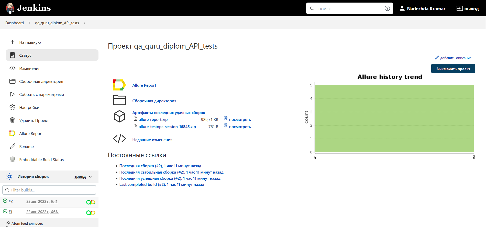
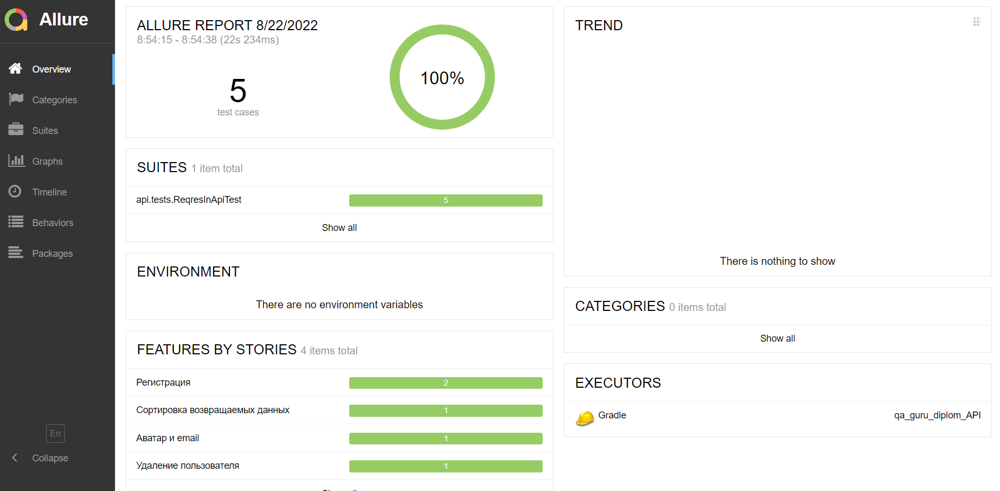
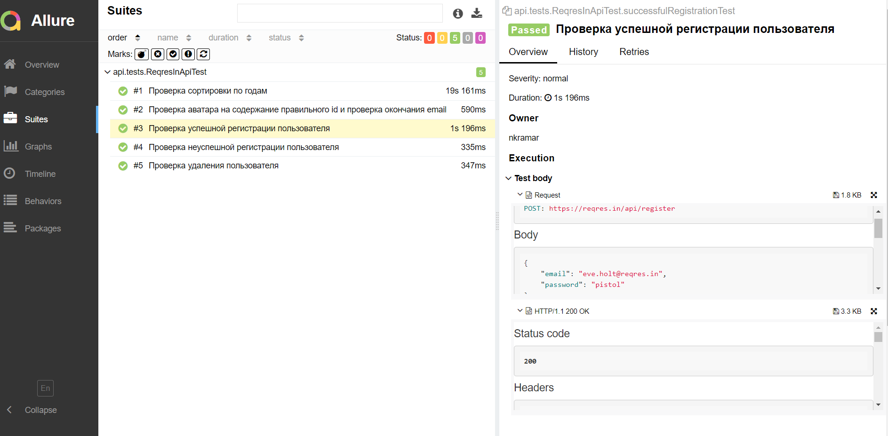
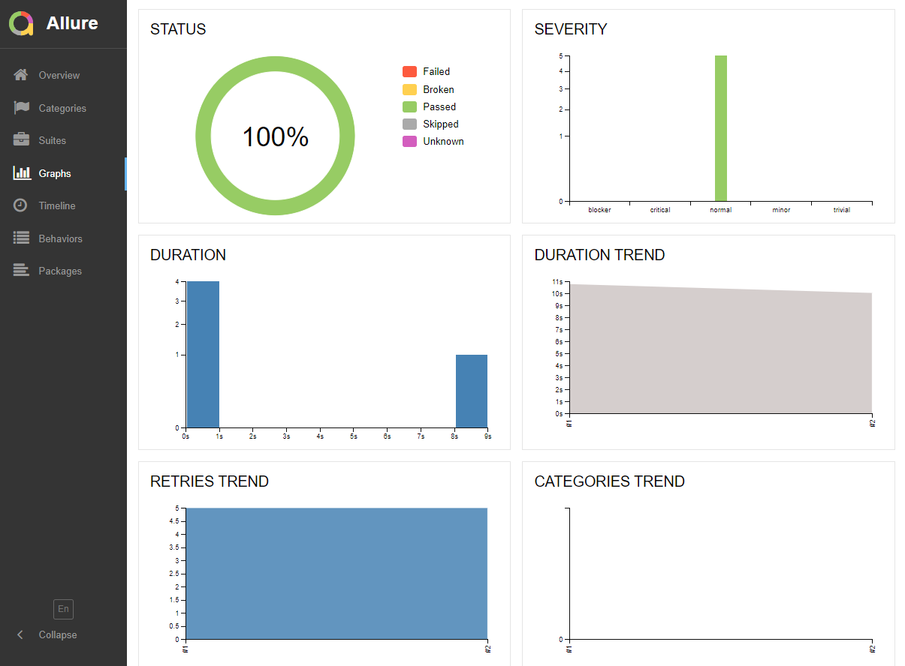
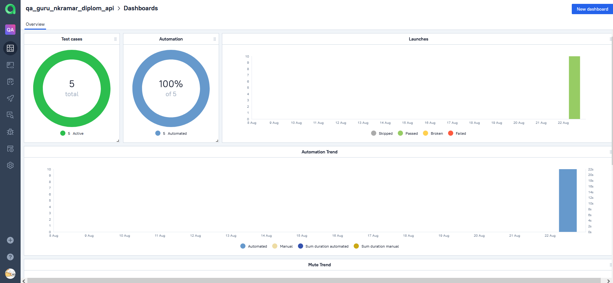
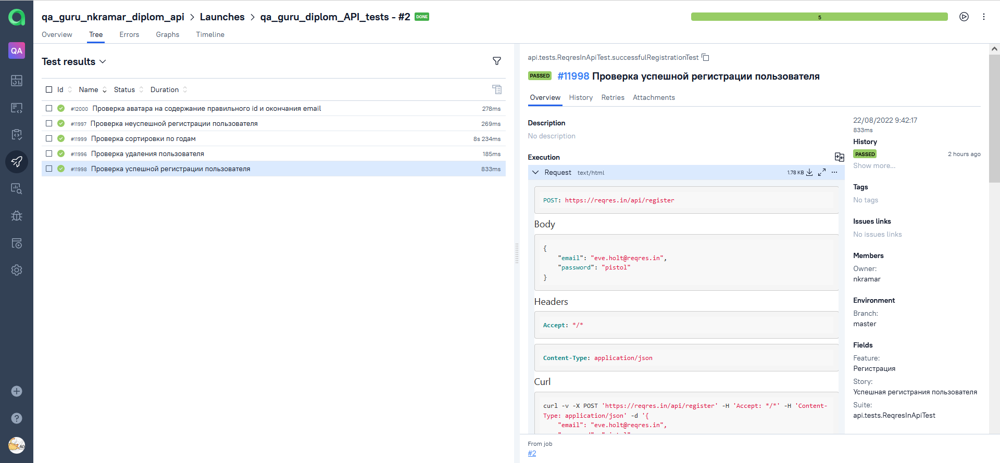
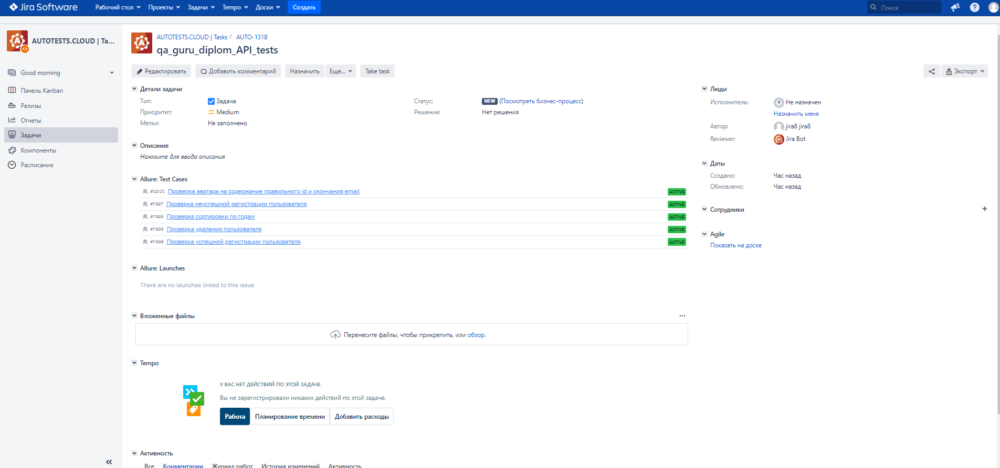
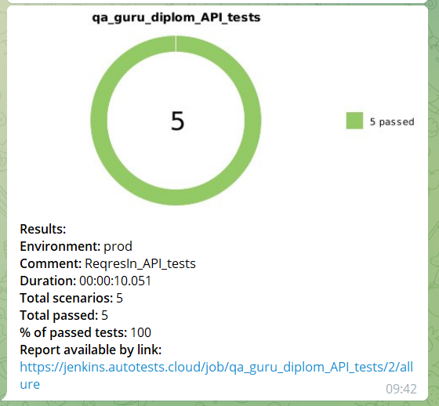

<h2 align="center"> Проект по автоматизации тестирования API для сайта REQRES.IN <a target="_blank" href="https://reqres.in/"></a> </h2>

<p align="center">

</p>


### :green_book: *Содержание*
- *Технологии и инструменты*
- *Примеры автоматизированных тест кейсов*
- *Сборка в Jenkins*
- *Команды для запуска из терминала*
- *Allure отчёт*
- *Интреграция с Allure TestOps*
- *Интеграция с Jira*
- *Уведомление в Telegram при помощи Alert bot*

____

## :computer: *Технологии и инструменты*

<p align="center">  
<a href="https://www.jetbrains.com/idea/"></a>  
<a href="https://www.java.com/"></a>  
<a href="https://github.com/"></a>  
<a href="https://junit.org/junit5/"></a>  
<a href="https://gradle.org/"></a>  
<a href="https://selenide.org/"></a>  
<a href="https://aerokube.com/selenoid/"></a>  
<a href="https://github.com/allure-framework/allure2"></a> 
<a href="https://qameta.io/"></a>   
<a href="https://avatars.githubusercontent.com/u/19369327?s=200&v=4"></a>  
<a href="https://avatars.githubusercontent.com/u/45949248?s=200&v=4"></a>  
<a href="https://www.jenkins.io/"></a>  
<a href="https://www.atlassian.com/ru/software/jira/"></a>  
</p>

____

## *Примеры автоматизированных тест кейсов*
- :white_check_mark: Проверка успешной регистрации пользователя
- :white_check_mark: Проверка неуспешной регистрации пользователя
- :white_check_mark: Проверка сортировки данных по годам
- :white_check_mark: Проверка удаления пользователя
- :white_check_mark: Проверка аватара на содержание правильного id и окончания email


____

## </a> Jenkins job
<a target="_blank" href="https://jenkins.autotests.cloud/job/qa_guru_diplom_API_tests/">**Сборка в Jenkins**</a>
<p align="center">  
<a href="https://jenkins.autotests.cloud/job/qa_guru_diplom_API_tests/"></a>  
</p>


____
## :keyboard: *Команды для запуска из терминала*

***Локальный запуск:***
```bash  
gradle clean test
```

***Удалённый запуск через Jenkins:***
```bash  
clean test
```

## </a> *Allure* <a target="_blank" href="https://jenkins.autotests.cloud/job/qa_guru_diplom_API_tests/">*отчёт*</a>
___

### *Основная страница отчёта*

<p align="center">  
  
</p>  

### *Тест кейсы*

<p align="center">  
  
</p>

### *Графики*

  <p align="center">  
  
</p>

___

## </a>*Интеграция с* <a target="_blank" href="https://allure.autotests.cloud/launch/15399/tree/155237?treeId=0">*Allure TestOps*</a>

## *Allure TestOps Dashboard*

<p align="center">  
  
</p>  

## *Тест кейсы*

<p align="center">  
  
</p>

___

## </a>*Интеграция с* <a target="_blank" href="https://jira.autotests.cloud/browse/AUTO-1318">Jira</a>

<p align="center">  
  
</p>

____
## </a> *Уведомление в Telegram при помощи Alert bot*

<p align="center">  
  
</p>


